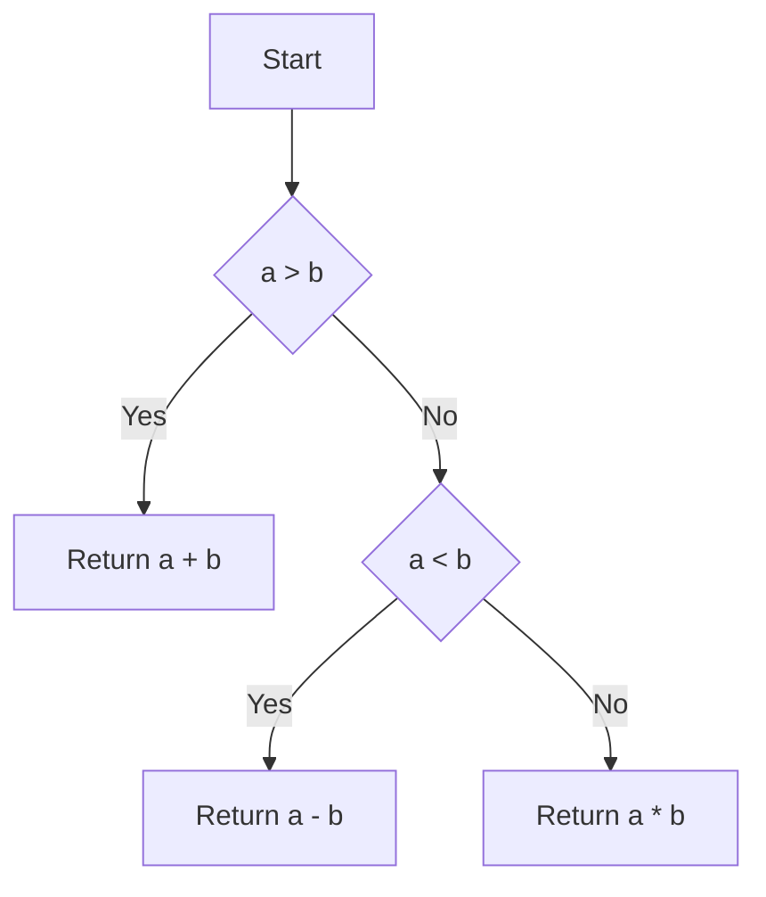

# Cyclomatic Complexity Clang Plugin

This repository is a small plugin for Clang which can be built and run to analyze the cyclomatic complexity of the code.

Cyclomatic complexity is a software metric that measures the complexity of a program by counting the number of independent paths through its source code. It provides insights into the potential number of test cases required to achieve full code coverage.

## Build Instructions

To build the plugin:

```bash
mkdir build
cd build
cmake ..
make
```

## Run Instructions

To analyze the cyclomatic complexity of your code using the Clang plugin, follow these steps:

1. Run the plugin on your code:
   The plugin takes a C++ source file as input and generates a report with the cyclomatic complexity values for each function in the code.

   ```bash
   clang-18 -cc1 -load ./libcyclomatic_complexity.so -plugin cyclomatic-complexity ../test/test.cpp
   ```

2. Visualize the control flow graph (CFG):
   The plugin can generate a CFG in `.dot` format, which can then be converted into an image for visualization.

   ```bash
   dot -Tpng complexFunction_cfg.dot -o complexFunction_cfg.png
   ```

3. Add a command line tool (optional) 

    This cli tool can be used anywhere across your system to find the cyclomatic complexity of a given c++ file.

    Inside the cc-analyzer file, replace /path/to/libcyclomatic_complexity.so with the actual path to your compiled plugin.
    Now run the following commands to create the cli tool command.

    ```bash
    chmod +x cc-analyzer
    sudo mv cc-analyzer /usr/local/bin/
    ```
    To find the cyclomatic complexity of any c++ file, replace the following command with your c++ file name.

    ```bash
    cc-analyzer <your-file-name>
    ```

## Install Instructions

    To check the cyclomatic complexity of a c++ program, you can just install the debian package, instead of following the run instructions.
    Here is the complete guide to install the package.

1. Download the cc-analyzer.deb package from the repository

2. Run the following installation command in the directory containing the downloaded debian package.

    ```bash
    sudo dpkg -i cc-analyzer.deb
    ```

3. Provide the execution access to the file.

    ```bash
    cd /usr/local/bin
    chmod +x cc-analyzer
    ```

4. Test the cyclomatic complexity of any c++ file by replacing your file name.

    ```bash
    cc-analyzer <your-file-name>
    ```

5. To uninstall the package from your system.

    ```bash
    sudo apt remove cc-analyzer
    ```

### Notes:

- You can change the path to the source file you want to analyze.
- The plugin requires the `-lstdc++` flag to link the C++ standard library.
- The plugin generates a report with the cyclomatic complexity values for each function in the code.
- Results are stored in a file named `results.cy`.

### Example of Cyclomatic Complexity Analysis

Let's take a detailed example to understand how cyclomatic complexity works. Consider the following code snippet:

```cpp
int calculateSum(int a, int b) {
    if (a > b) {
        return a + b;
    } else if (a < b) {
        return a - b;
    } else {
        return a * b;
    }
}
```

In this example, we have a function `calculateSum` that takes two integers as input and returns their sum, difference, or product based on certain conditions.

To calculate the cyclomatic complexity of this function, we count the number of decision points, which include conditional statements (`if`, `else if`, `else`) and loop statements (`for`, `while`, `do-while`). In this case, we have three decision points: the `if` statement, the `else if` statement, and the `else` statement.

The cyclomatic complexity is then calculated using the formula: `M = E - N + 2P`, where:

- `E` is the number of edges in the control flow graph (number of decision points + 1)
- `N` is the number of nodes in the control flow graph (number of statements + 1)
- `P` is the number of connected components (1 for a single function)

For our example, `E = 4`, `N = 5`, and `P = 1`. Therefore, the cyclomatic complexity `M` is `4 - 5 + 2*1 = 1`.

### Control Flow Graph Example

To visualize the control flow graph and understand the paths through the code, you can use markdown graphs. Here's an example of how you can represent the control flow graph for our `calculateSum` function:



This graph shows the different paths that can be taken based on the conditions. By analyzing the cyclomatic complexity and the control flow graph, you can identify potential areas of code that may require additional testing or refactoring to improve code quality.

---